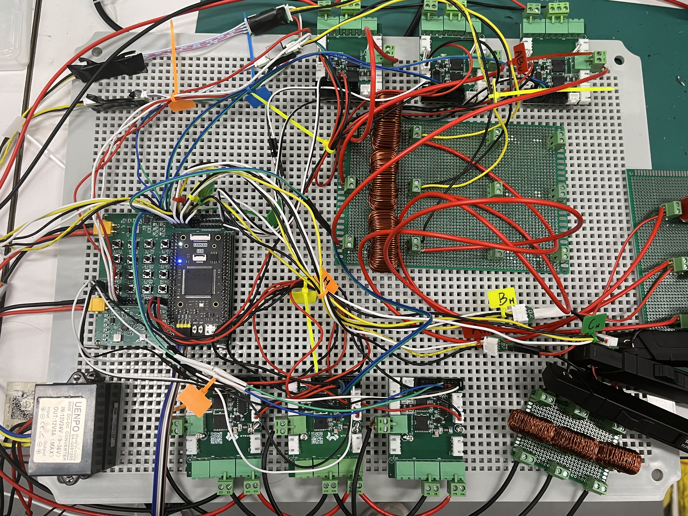

# 2025年全国大学生电子设计竞赛 A题 能量回馈的变流器负载试验装置

## 0. 题目

> 本作品最终获得国二(广东赛区)。

> **该作品可优化点：**
>
> 1. 辅源系统设计：该作品为保证隔离使用的现有辅助电源模块，实测两个辅源模块的功耗接近4W，极大影响效率；
> 2. 半桥硬件设计：该作品使用的 GaN 半桥，但是由于硬件设计不成熟，其效率应该在 90% 左右，仍有优化空间。

> **该作品值得借鉴的点：**
>
> 1. 电压电流采样方案；
> 2. 架构设计和软件算法。

系统实物图：

## 1. 硬件设计

***硬件各部分设计(半桥，电压采样，电流采样)见 `Hardware` 文件夹***。

系统框图：

> 1. 半桥采用 GaN 半桥以提高效率；
>
> 2. 电压采样采用隔离光耦模块，完全去掉了共模电压影响。
> 3. 电流采样采用霍尔采样，保证了精度。
> 4. 逆变器使用 20kHz 开关频率，LC 滤波器采用以下配置：2mH 电感 + 25uF 电容(谐振频率 711Hz，能够避免3/5次谐波谐振(**谐波谐振会导致 THD 不达标**))。 
> 5. LCL 的谐振频率不应该太低，也不能太高，采用 2mH 电感 + 25uF 电容(谐振频率 1005Hz) 使得谐振峰离 50Hz 较远(保证控制器能够控制)，也能离 20kHz 较远(消除谐振影响)。

**硬件隔离是必要的，至少保证以下部分的隔离：主电路/驱动电路/控制器电路。**

## 2. 软件设计

***软件源代码见 `SoftWare` 文件夹。仿真设计见 `Model` 文件夹。***

### 仿真

**电源设计先做仿真！！！不仅要对稳态仿真，还要评估可能的暂态过程，以此为依据设计状态机。**

仿真最好使用能用 MCU/DSP 复现的离散域仿真。

算法框图：

> **基础部分：**
>
> 逆变器使用正常电压环即可，THD 取决于主电路参数，而调整率取决于采样精度。

> **发挥部分：**
>
> 1. 逆变器侧用电压环控制母线的电压(**不要控制电流，电流由负载/变流器给定**)；
>
> 2. 整流器侧：和三相PWM整流器(PFC)一致，但是不需要对电压进行锁相，直接使用逆变器指令。$u_d$ 和 $u_q$ 指令采用前馈+PI控制：使用逆变器的 $u_d$ 和 $u_q$ 指令进行前馈，PI控制器的输出直接加在前馈指令上。
>
> 3. 关于零序抑制：**由于共母线，导致零序电流会形成环流。**所以 SVPWM 调制是不可行的，应当采用 SPWM 调制。
>
>    同时可以采用**零序电流抑制器**：$u_0 = K_0 (i_a+i_b+i_c)$，$u_{abc}$ 指令加上该抑制器输出。
>
>    也可以考虑使用隔离变压器，但是势必会严重影响效率。

### 软件/调试

**调试原则：写好保护(过流/过压)，写好状态机，写好启动/停止按键；先低压/低功率再高压/高功率。绝对注意安全！！！**（安全意识让作者的作品没有炸过任何一个器件）

软件的状态机是：**开机 - 选择题目 - 校准 - 根据题目运行相应部分代码。**

## 3. 报告

报告见 `Report` 文件夹。

## 4. 一点吐槽

2025 年的电源题有 A/B 两题，A 题十分正常，但是 B 题的 APF 技术根本不是本科生能做的难度，全国仅有一百多组 B 题；相比之下，A 题可谓十分的卷，做出来还不一定能进综合测评，必须把效率优化到极致，所以半桥的效率必须在准备阶段就做到 99% 左右。